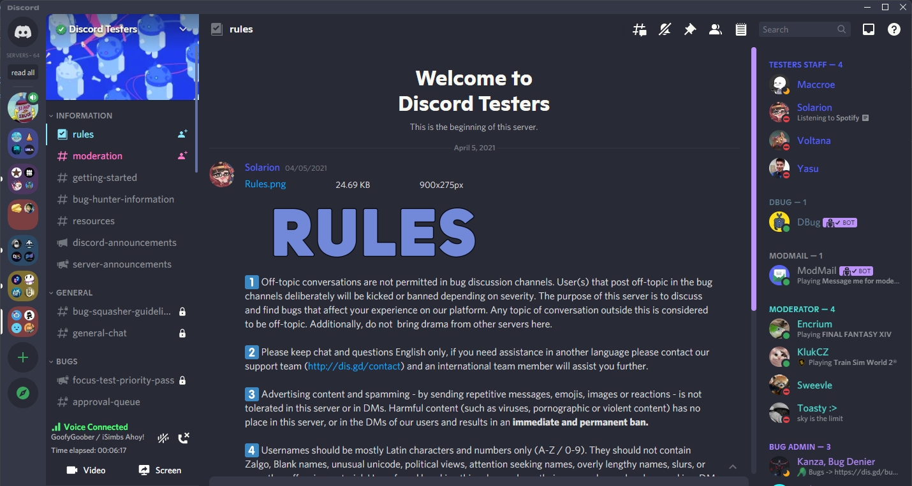

# Dracula Theme for [BetterDiscord](https://betterdiscord.app)

> This is a fork of the original [Dracula theme for BetterDiscord](https://github.com/dracula/betterdiscord). I am building my theme to supply fixes to the original theme as well as make changes that I have garnered inspiration for from other themes.

## Team

|  |
|------------------------------------------------------------------------------------------------|
| [JYLN](https://github.com/JYLN)                                                                |

## Credits
The original Dracula BetterDiscord theme is maintained by the following person(s) and a bunch of [awesome contributors](https://github.com/dracula/betterdiscord/graphs/contributors).

|  |
|---------------------------------------------------------------------------------------------------------------|
| [Kabir Kwatra](https://github.com/KabirKwatra)                                                                |

As well, I owe a huge thank-you to [LuckFire](https://github.com/LuckFire) for the inspiration of the channel indicator styling that I built in conjunction with this theme. You can view their work [here](https://github.com/Discord-Theme-Addons/modern-channel-indicators).

Another thank-you goes to [schnensch0](https://github.com/schnensch0) as their [Zelk](https://github.com/schnensch0/zelk) theme gave me the inspiration to use the settings menu icons provided by [mwittrien](https://github.com/mwittrien). 

## License

[License](https://github.com/JYLN/Dracula-BetterDiscord-Theme/blob/jyln-master/LICENSE)
